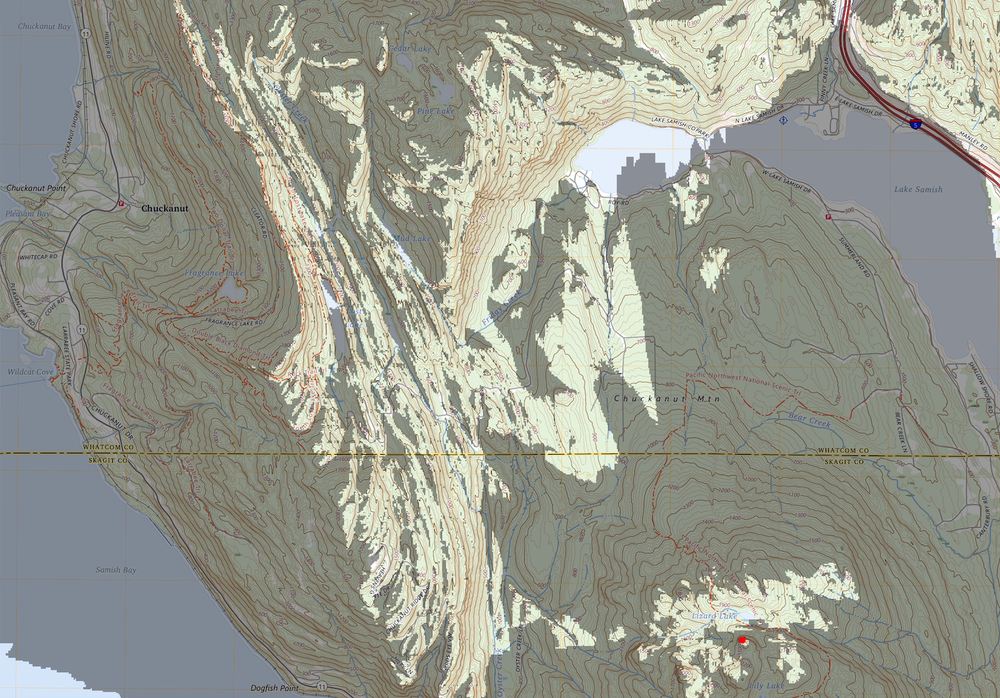

# LOS
Line Of Sight GIS tool in Rust.

This project exports a map for any given coordinate,
with the area of the map visible from that coordinate highlighted.
This is called a "viewshed" in GIS terminology.



System overview:

1. [Digital Elevation Model (DEM) retrieval](#dem-retrieval)
2. [Elevation lookup from DEM datasets](#dem-reader)
3. [Line of sight calculation](#line-of-sight-calculation)
4. [Map retrieval](#map-retrieval)
5. [Map rendering](#map-rendering)

The current default implementation uses [USGS 3DEP data streamed via GDAL from AWS-hosted VRT datasets](#usgs-source).

## Usage

### Quick Start

Export a viewshed map for a given coordinate:

```bash
cargo run -- highlight --lat 48.629936 --lon -122.407294
```
This writes `map.png` to the current directory, which contains a topographical
map containing the given coordinate, with the coordinate indicated in red, and
visible area highlighted.

<details>
<summary>Check if a clear line of sight exists between two points</summary>

```bash
cargo run -- sightline --lat 48.777196 --lon -121.814224 --target-lat 48.831007 --target-lon -121.603571
```

```text
Line of sight from (48.777196, -121.814224) to (48.831007, -121.603571) is clear.
```
</details>

<details>
<summary>Query elevation at a given coordinate</summary>

```bash
cargo run -- elevation --lat 48.7766298 --lon -121.8144732
```

```text
Elevation at (48.7766298, -121.8144732): 3281.13 m (10764.87 ft)
```
</details>

<details>
<summary>CLI Help</summary>

```bash
cargo run -- --help
```


```text
CLI for the Line of Sight library. Provides commands for elevation queries, topographical map retrieval, sightline analysis, and visibility highlighting based on geographic coordinates

Usage: los [OPTIONS] <COMMAND>

Commands:
  elevation  Find elevation at a given lat/lon using a specified reader and source
  topo       Retrieve a topographical map for a given lat/lon
  sightline  Determine if the target point is visible from the observer point
  highlight  For a given lat/lon, output a map with visible area highlighted
  help       Print this message or the help of the given subcommand(s)

Options:
  -r, --reader-type <READER_TYPE>  Type of reader to use [default: gdal] [possible values: geotiff, gdal]
  -s, --source-type <SOURCE_TYPE>  Source for fetching the DEM (ignored if dem_path is provided) [default: usgs] [possible values: usgs, opentopo]
  -l, --local-dem <LOCAL_DEM>      Path to a local GeoTIFF file to bypass using an automatic source (overrides source_type if provided)
  -u, --url-dem <URL_DEM>          Remote URL to a DEM file to bypass using an automatic source (overrides source_type if provided)
  -h, --help                       Print help
```
</details>

See `src/cli/interface.rs` for more details on available commands and options.

### Release build
```bash
cargo build --release
target/release/los elevation --lat 48.7766298 --lon -121.8144732
```

```text
Elevation at (48.7766298, -121.8144732): 3281.13 m (10764.87 ft)
```

## Testing

Run all tests:

```bash
cargo test
```

### Test Data

Integration tests use a small local GeoTIFF fixture located in `tests/data/`.

These tests validate:
- Opening DEM datasets via different readers
- Elevation lookup at known coordinates
- Out-of-bounds behavior
- Line of sight calculations between known points

## Architecture

The system is designed to separate *where DEM data comes from* from *how it is read*.

### DEM Retrieval

`src/source/`

Responsible for resolving which DEM dataset should be used for a given coordinate.

#### USGS Source

The current implementation uses the USGS 3DEP seamless DEM VRT hosted on AWS:

- https://prd-tnm.s3.amazonaws.com/StagedProducts/Elevation/13/TIFF/USGS_Seamless_DEM_13.vrt

This VRT acts as a global index over many GeoTIFF tiles.

Using GDAL, this enables:

- global DEM access without downloading full datasets
- on-demand retrieval of only the required GeoTIFF tiles
- efficient streaming via HTTP range requests (`/vsicurl/`)

In practice:

- a query for a single `(lat, lon)` is resolved to a specific underlying GeoTIFF tile
- GDAL fetches only the required byte ranges from that tile

**Note:**  
Reading a single point may still trigger a full internal block read (e.g., 128×128 pixels), resulting in ~10s–100s of KB of network transfer per lookup.

#### Future Sources

- OpenTopography
- AWS Terrain Tiles

### DEM Reader 

`src/reader/`

Responsible for opening a DEM and providing elevation lookup.

- `DemReader`: opens a dataset and returns a `DemHandle`
- `DemHandle`: provides `elevation_at(lat, lon)`

Readers also provide support for pre-fetching regions to avoid repeated network
requests for nearby points, which is important for line of sight calculations.

#### GDAL Reader

`GdalReader` supports remote and local datasets. It depends on a local installation of GDAL.

#### geotiff Reader

`GeoTiffReader` supports local GeoTIFF files only. It is a lightweight
implementation using the `geotiff` crate, without external dependencies.

The goal is to expand on this after implementing a DEM source that pulls TIF
files that are small enough to be downloaded in their entirety, such as AWS Terrain Tiles.

### Elevation Service (`src/service/`)
Combines a `DemSource` and `DemReader` to provide elevation lookup.

### Map Retrieval

`src/source/topo/`

So far, the TopoSource implementation has been completed for USGS National Map
data, which provides topographical maps at various scales. It pulls the
7.5-minute quadrangle maps, which have a resolution of 1:24,000. These maps are
available as GeoPDFs and are downloaded after determining which URL corresponds
to the map that contains the point.

#### Source Search

The URLs that point to the ultimate GeoPDF files are contained in a zipped CSV
file that contains maximum and minimum latitudes and longitudes for each map,
as well as the URL to the GeoPDF. The source implementation loads this
information into a SQLite database, and uses R-tree indexing for efficient
lookup.

### Map Rendering

`src/service/highlighter.rs`

The Highlighter Service takes a descriptor of a topographic map, and the results
of line of sight calculations, and produces a rendered map with the visible area
highlighted. The current implementation relies heavily on `gdal` for reading
GeoPDFs and pulling pixel data from the raster layers. It uses `image` for
drawing the highlight overlay and exporting the final image.

## Dependencies
At the moment, the default CLI path depends on GDAL for remote USGS access.
A lightweight local-only `geotiff` reader also exists, but the project currently assumes [GDAL is installed](https://gdal.org/en/stable/download.html).

`brew install gdal` on macOS.

GDAL is a large native dependency, but it enables remote DEM access via VRT and HTTP range requests.

A long-term goal is to make this optional and support a pure-Rust `geotiff` implementation for local datasets or for use with OpenTopo.

## Line of sight calculation

Point-to-point line of sight algorithm is in `src/service/los.rs`.

The implementation recursively splits the line between the observer and target
points, checking the elevation at the midpoint against the straight line
between the observer and target. If the elevation at the midpoint is above the
straight line, then there is no line of sight. If it is below, then we check
the two halves of the line recursively until we reach a certain resolution or
depth limit.

It returns a result which is either Clear or Blocked, and if blocked, the
result contains the coordinates of the obstruction and elevation at that point.

An optional viewer height can be added to the observer elevation to account for
the height of the observer above ground level.

## TODO

### Core functionality
- Implement AWS Terrain Tile DEM retrieval
- Correction for earth curvature
- Configurable step size / resolution for line of sight calculation
- Implement non-PDF map retrieval from https://basemap.nationalmap.gov/arcgis/rest/services/USGSTopo/MapServer/tile/{z}/{y}/{x}
  - Use standard Web Mercator tile math to fetch correct tile for given lat/lon and zoom level
- New CLI arg to adjust viewer height

### Performance / usability improvements
- Make GDAL an optional dependency
  - Implement fetch of remote GeoTIFF files, and use the existing `GeoTiffReader`
    - This will require work on a DEM source that has small enough tiles that
    they can be downloaded in their entirety, such as AWS Terrain Tiles
    - Automatically determine if DEM file has Web Mercator or geographic
    coordinates, and handle reprojection if necessary
  - Download png topo maps rather than GeoPDFs, and handle entirely with `image` crate
  

### Map features
- Force refresh of topo cache

### Clean up

- Error handling - remove anyhow?
- Consistency in exports across modules
- Passing configs into all commands

### Research
- Look into ASTER GDEM
    - https://www.tellusxdp.com/en-us/catalog/data/aster_gdem_ver_3.html
    - Pixel interval: 1 sec (Approximately 30 m)
    - Height accuracy: 7-14 m
- Look into AWS Terrain Tiles
    - https://registry.opendata.aws/terrain-tiles/
    - Global coverage at zoom levels 0-15, sourced from ~10m USGS data
